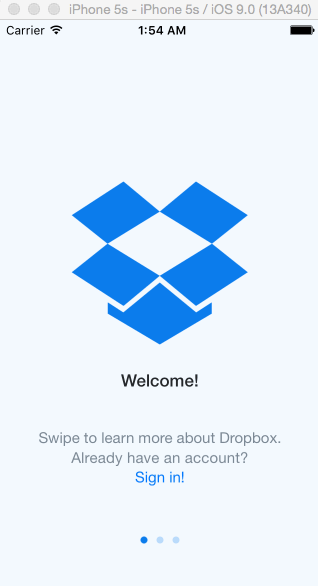

# dropbox-w1

This is an iOS demo appliction to use Xcode to implement the flow between the screens of an application.

Time spent: 7 hours spent in total

Completed user stories:

 Required: User can tap through the 3 welcome screens
 Required: User can follow the create user flow
 Required: User can follow the sign in flow
 
 Notes:
 In the controllers if I enable the back button and the performSegueWithIdentifier I have some crashes. I would appreciate it if you could help me with some advices.
 

